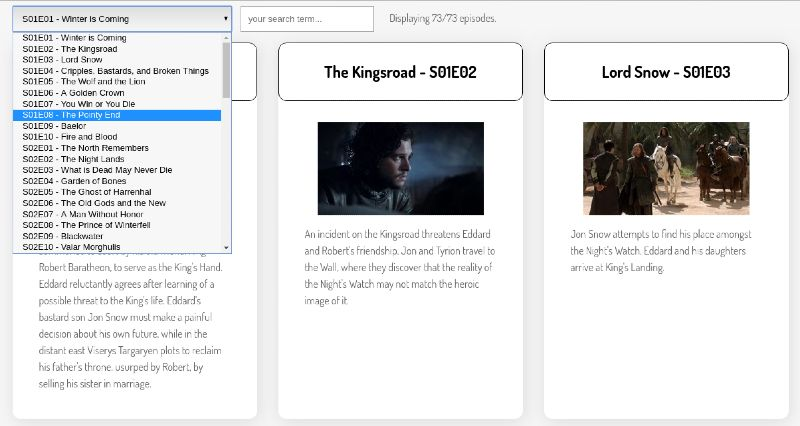

# Level 300 - Minimal features for level 300

1. Complete all minimal requirements from previous levels
1. Tidy up the summaries: the original data for the episode summaries contained html tags such as `
`. If you haven't already done so, have your _code_ remove these from the string before displaying it on screen. Do **not** try to fix these by manually editing the data file(s)!
    1. Ensure this summary-cleaning functionality is extracted to a pure function and add a unit test for it.
1. Ensure the app works with different data. Change the data file (at least temporarily) so that it is [the data from The Simpsons](https://api.tvmaze.com/shows/83/episodes). This has been made available in the starter app. Then, ensure your app still runs fine with this specific data. If it doesn't, you'll need to diagnose the cause and change your code to resolve the problem. If you're using JSDoc, you'll likely want to update the typedef, too. (This statement is intentionally vague so it doesn't provide the solution to a problem YOU have to work through!)

### Optional: Add an Episode Selector

If you're doing this project in a single week, skip this optional functionality. In level 400 you will work with a select input.

1. Add a `select` input which allows you to jump quickly to an episode:
    1. The select input should list all episodes in the format: "S01E01 - Winter is Coming"
    1. When the user makes a selection from the list, they should then ONLY be shown the selected episode. Be sure to provide a way for the user to see all episodes again (e.g. by clicking a button).

## Example screenshot of Episode Selector

Note: Provided your project meets the above requirements, it can **look** however you want.

Here is one example layout.

[<< level 250](./level-250.md) - [top](./readme.md) - [level 350 >>](./level-350.md)
