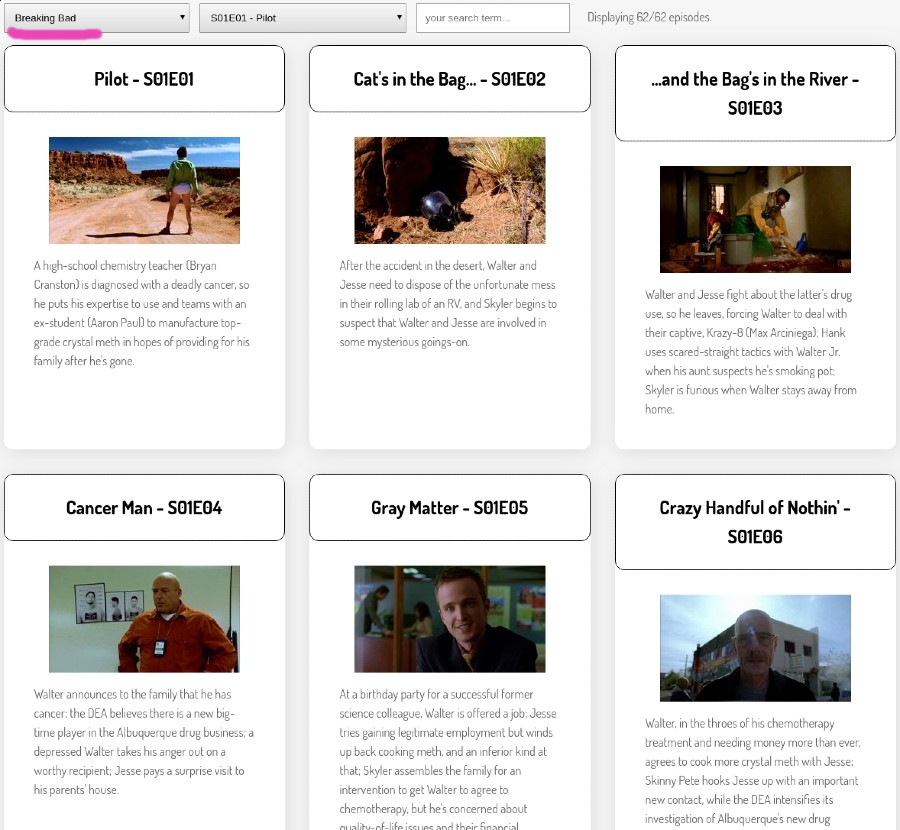
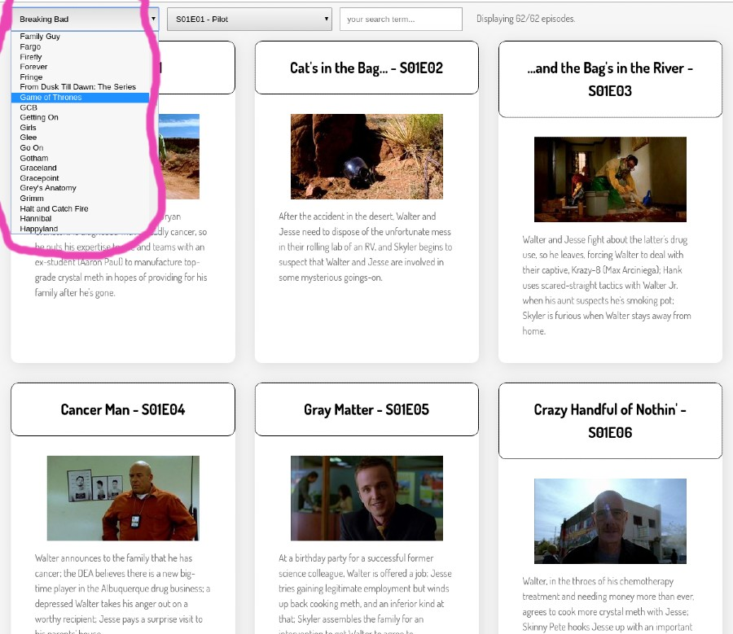

# Level 400 - Add a Show Selector

**Pre-req**: For this level you will have to have learned to use fetch() to `GET` JSON content from an API.

1. Complete all minimal requirements from previous levels
1. Add a `select` input which allows you to choose which **show** you are interested in
    1. You can get a large (but not comprehensive) list of shows from the API endpoint: `http://api.tvmaze.com/shows?page=1`. To keep things simple in this exercise, it is recommended that you download these results only once and then store them in a local file (e.g. showsData.js) rather than have your app fetch the show list from tvmaze every time. However, you're welcome to do the latter, if you prefer - it's probably a more realistic solution.
    1. When a show is selected, your app should display the episodes for that show as per the earlier levels of this challenge, except that it will first need to fetch the **episode list** from the API using axios.get - see below.
    1. Ensure that your search (and, if you have it, episode selector) controls still work correctly when you switch shows.
    1. This show selector must list shows in alphabetical order, case-insensitive.

## Note on fetching episode lists

Once the user selects a show you should `fetch` the episodes list using URLs of the following pattern:

`https://api.tvmaze.com/shows/SHOW_ID/episodes` where `SHOW_ID` should be replaced with the numeric id of the selected show.

For example, `https://api.tvmaze.com/shows/82/episodes` will return the episodes for show `82` ("Game of Thrones").

## Example screenshots of Show Selector

Note: Provided your project meets the above requirements, it can **look** however you want.

Here is one example layout.

## Play nice - a note on using `fetch` during development

Be _careful_ when developing with fetch. By default, every time you make a small change to your app source code it will be restarted by nodemon. If you are fetching JSON on page load, the JSON will be downloaded again and again after every saved file change. These frequent HTTP requests may lead to the API permanently banning your IP address from further requests, or "throttling" it for some time. Worse, if they _don't_ get your machine banned or throttled, they may cause performance issues for the (freely provided) API service we are using. In all cases, it's just very bad etiquette to generate lots of unnecessary traffic.

A more advanced solution would cache data downloaded from an API for some time (e.g. 1 day), but that's probably out of scope, here. Consider switching to loading the data from src/data/ directory when you are developing sections of the app that don't require it to be live data.

You could also ensure that a console log message is emitted (or a counter updated) every time you make a request with fetch or axios, so you are more aware of these downloads occurring.

[<< level 350](./level-350.md) - [top](./readme.md) - [level 500 >>](./level-500.md)
